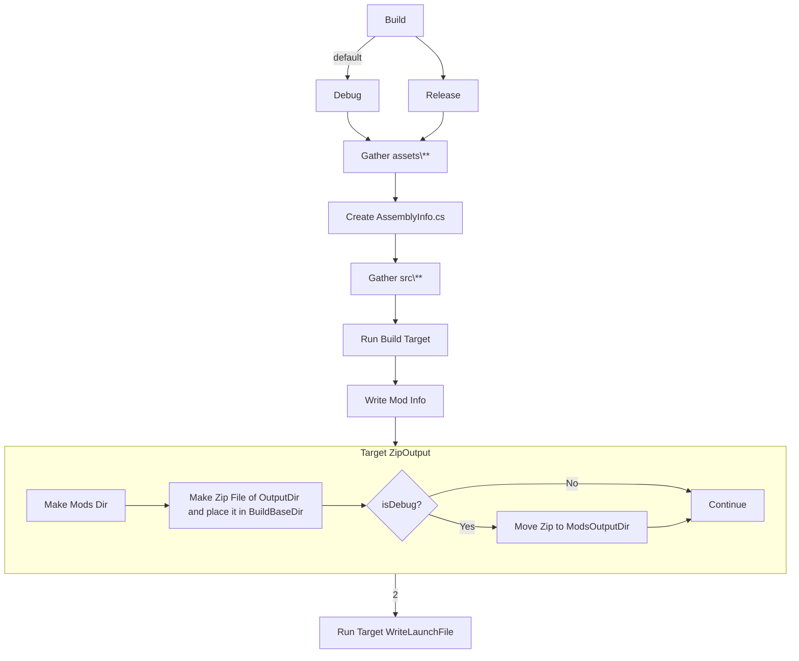

# VintageStoryModTemplate
Simple Mod Template I use for my mods


- [VintageStoryModTemplate](#vintagestorymodtemplate)
  - [Build Pipeline](#build-pipeline)
  - [Build Variables](#build-variables)
    - [Settings Files](#settings-files)
      - [Project Level Variable File](#project-level-variable-file)
      - [Local Variable File](#local-variable-file)
    - [Specifying Game Files Location/s](#specifying-game-files-locations)
      - [Setting up Static Game Files Path](#setting-up-static-game-files-path)
        - [Example Using a static path to your VintageStory Game files](#example-using-a-static-path-to-your-vintagestory-game-files)
        - [Example using an environment variable](#example-using-an-environment-variable)
      - [Setting up Dynamic Game Files Paths](#setting-up-dynamic-game-files-paths)
- [Thanks to](#thanks-to)

## Build Pipeline
The following is the current pipeline flow.


## Build Variables
Most other solutions want you to setup environment variables to configure your build environment, but I don't think that is always desirable.
Additionally, I personally don't like too many environment vars clogging up my systems env space.
For these reasons all the build variables are stored in the folder `/config/`, this is not however to say that you can't use env vars, In fact I have included some examples of how to use some common ones.

### Settings Files
#### Project Level Variable File
All the global default variables are stored in the file `/config/settings.targets` this is where you should put the settings that are common for all the developers.

**Note:** that all the lines in this file have conditions that say if the var is empty make it this. This allows individual developers to override any of the vars for their environment without effecting other developers.

#### Local Variable File
The Project level variable file `/config/settings.targets` tries to load another file `/config/uniqueValues.targets` this file is listed in the .gitignore and thus is not committed to the repo on a push. This is so that each developer or environment can have its own settings in this file that are unique and/or private to them such as where their game files live.

To make things easier for developers I have included an example of this file at `/config/uniqueValues.targets.example` just copy and rename this to `/config/uniqueValues.targets` and then customize your dev enviorment.


### Specifying Game Files Location/s

The pipeline builds a launch settings file `/.vscode/launch.json` and also uses the DLL files in the game files folders to build the mod source. Because of this its important to know how to tell the pipeline where to find the files on your system, on you CI/CD system, or anywhere else you run the pipeline.

I have added 2 ways of specifying the location of the game files on your system Static and Dynamic. Personally I use the dynamic method and highly recommend that, but I understand some people may not or may want to use the `VintageStory` env var.

#### Setting up Static Game Files Path
Using the `GameFilesStaticLocation` setting will tell the pipeline that you do not want to use the prefix/suffix system of defining game file locations, and you want to just use a specified path.

> **Note:** If the case-sensitive value `prefix` is used in the `GameFilesStaticLocation` var the pipeline will assume you do want to use the prefix/suffix system instead of a static path. 
> 
> This is useful if you want to use the prefix/suffix system, but others in the project do not and want the default to be a static path or environment variable.
##### Example Using a static path to your VintageStory Game files
```xml
<!--This example is in uniqueValues.targets.example-->
<GameFilesStaticLocation>C:\Games\VintageStory\Vintagestory</GameFilesStaticLocation>
```
##### Example using an environment variable
This line will use the system environment variable `VINTAGE_STORY` as the location of files
```xml
<!--This example is in uniqueValues.targets.example-->
<GameFilesStaticLocation>$(VINTAGE_STORY)</GameFilesStaticLocation>
```

#### Setting up Dynamic Game Files Paths
This system will combine the `GameFilesPrefix` and `VersionGame` settings to create the location of the game files.

An example file structure might look like you having a folder on your C drive named `C:\Games\VintageStory\` and inside there you have all the diffrent version of the game files.

Note that on a unix/linux/mac system this may look like something else for example `/var/game/vs/`.

Now lets say inside that folder you have 2 versions one is 1.16.5 and the other is 1.17.0rc7

```
C:\Games\VintageStory\vs_1.16.5\VintageStory.exe
C:\Games\VintageStory\vs_1.17.0rc7\VintageStory.exe
```

You would set the `GameFilesPrefix` in your `/config/uniqueValues.targets` file as something like this:
```XML
<?xml version="1.0" encoding="utf-8"?>
<Project xmlns="http://schemas.microsoft.com/developer/msbuild/2003">
    <PropertyGroup>
        <!-- ... -->
        <GameFilesPrefix>C:\Games\VintageStory\vs_</GameFilesPrefix>
        <!-- ... -->
    </PropertyGroup>
</Project>
```

Note that we only have part of the path here the other half of the path comes from the `VersionGame` property this should likely be set in `/config/settings.targets`

# Thanks to
Discord
* Fulgen
  * Help with `ModDependency` Attribute format/usage
* https://github.com/Copygirl/howto-example-mod
  * Showing me the correct way to get vscode to launch the game in debug mode