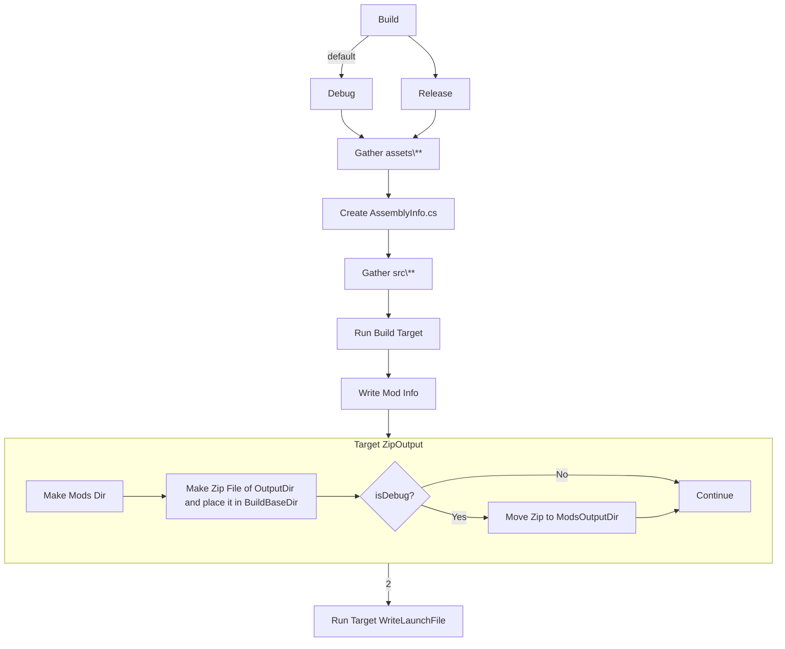

# VintageStoryModTemplate
Simple Mod Template I use for my mods

# Build Pipeline
The following is the current pipeline flow.

### Thanks to
Discord
* Fulgen
  * Help with `ModDependency` Attribute format/usage
* https://github.com/Copygirl/howto-example-mod
  * Showing me the correct way to get vscode to launch the game in debug mode