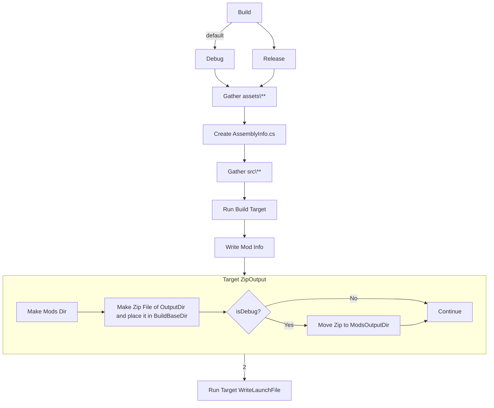

# VintageStoryModTemplate
Simple Mod Template I use for my mods


- [VintageStoryModTemplate](#vintagestorymodtemplate)
  - [Build Pipeline](#build-pipeline)
  - [Build Variables](#build-variables)
    - [Settings Files](#settings-files)
      - [Project Level Variable File](#project-level-variable-file)
      - [Local Variable File](#local-variable-file)
    - [Specifying Game Files Location/s](#specifying-game-files-locations)
      - [Setting up Static Game Files Path](#setting-up-static-game-files-path)
        - [Example Using a static path to your VintageStory Game files](#example-using-a-static-path-to-your-vintagestory-game-files)
        - [Example using an environment variable](#example-using-an-environment-variable)
      - [Setting up Dynamic Game Files Paths](#setting-up-dynamic-game-files-paths)
    - [Mod MetaData](#mod-metadata)
      - [Mod Type](#mod-type)
        - [Theme Packs](#theme-packs)
        - [Content Mods](#content-mods)
        - [Code Mods](#code-mods)
      - [Mod Versioning](#mod-versioning)
      - [Mod Authorship](#mod-authorship)
        - [Single Attribution](#single-attribution)
        - [Multi-Attribution](#multi-attribution)
      - [Mod Game Version Compatibility](#mod-game-version-compatibility)
      - [Mod Website](#mod-website)
      - [Mod Description](#mod-description)
      - [Mod Dependencies](#mod-dependencies)
    - [ModInfo.json and AssemblyInfo.cs config](#modinfojson-and-assemblyinfocs-config)
      - [AssemblyInfo.cs](#assemblyinfocs)
        - [AssemblyTitle](#assemblytitle)
        - [AssemblyDescription](#assemblydescription)
        - [AssemblyConfiguration](#assemblyconfiguration)
        - [AssemblyCompany](#assemblycompany)
        - [AssemblyProduct](#assemblyproduct)
        - [AssemblyCopyright](#assemblycopyright)
        - [Guid](#guid)
        - [AssemblyVersion](#assemblyversion)
        - [AssemblyFileVersion](#assemblyfileversion)
        - [ModDependency](#moddependency)
        - [ModInfo](#modinfo)
          - [Human Name](#human-name)
          - [Mechine Name](#mechine-name)
          - [Version](#version)
          - [Authors](#authors)
          - [Website](#website)
          - [Description](#description)
        - [Not Currently Supported](#not-currently-supported)
          - [AssemblyTrademark](#assemblytrademark)
          - [AssemblyCulture](#assemblyculture)
          - [ComVisible](#comvisible)
- [Thanks to](#thanks-to)

## Build Pipeline
The following is the current pipeline flow.


## Build Variables
Most other solutions want you to setup environment variables to configure your build environment, but I don't think that is always desirable.
Additionally, I personally don't like too many environment vars clogging up my systems env space.
For these reasons all the build variables are stored in the folder `/config/`, this is not however to say that you can't use env vars, In fact I have included some examples of how to use some common ones.

### Settings Files
#### Project Level Variable File
All the global default variables are stored in the file `/config/settings.targets` this is where you should put the settings that are common for all the developers.

**Note:** that all the lines in this file have conditions that say if the var is empty make it this. This allows individual developers to override any of the vars for their environment without effecting other developers.

#### Local Variable File
The Project level variable file `/config/settings.targets` tries to load another file `/config/uniqueValues.targets` this file is listed in the .gitignore and thus is not committed to the repo on a push. This is so that each developer or environment can have its own settings in this file that are unique and/or private to them such as where their game files live.

To make things easier for developers I have included an example of this file at `/config/uniqueValues.targets.example` just copy and rename this to `/config/uniqueValues.targets` and then customize your dev enviorment.


### Specifying Game Files Location/s

The pipeline builds a launch settings file `/.vscode/launch.json` and also uses the DLL files in the game files folders to build the mod source. Because of this its important to know how to tell the pipeline where to find the files on your system, on you CI/CD system, or anywhere else you run the pipeline.

I have added 2 ways of specifying the location of the game files on your system Static and Dynamic. Personally I use the dynamic method and highly recommend that, but I understand some people may not or may want to use the `VintageStory` env var.

#### Setting up Static Game Files Path
Using the `GameFilesStaticLocation` setting will tell the pipeline that you do not want to use the prefix/suffix system of defining game file locations, and you want to just use a specified path.

> **Note:** If the case-sensitive value `prefix` is used in the `GameFilesStaticLocation` var the pipeline will assume you do want to use the prefix/suffix system instead of a static path. 
> 
> This is useful if you want to use the prefix/suffix system, but others in the project do not and want the default to be a static path or environment variable.
##### Example Using a static path to your VintageStory Game files
```xml
<!--This example is in uniqueValues.targets.example-->
<GameFilesStaticLocation>C:\Games\VintageStory\Vintagestory</GameFilesStaticLocation>
```
##### Example using an environment variable
This line will use the system environment variable `VINTAGE_STORY` as the location of files
```xml
<!--This example is in uniqueValues.targets.example-->
<GameFilesStaticLocation>$(VINTAGE_STORY)</GameFilesStaticLocation>
```

#### Setting up Dynamic Game Files Paths
This system will combine the `GameFilesPrefix` and `VersionGame` settings to create the location of the game files.

An example file structure might look like you having a folder on your C drive named `C:\Games\VintageStory\` and inside there you have all the diffrent version of the game files.

Note that on a unix/linux/mac system this may look like something else for example `/var/game/vs/`.

Now lets say inside that folder you have 2 versions one is 1.16.5 and the other is 1.17.0rc7

```
C:\Games\VintageStory\vs_1.16.5\VintageStory.exe
C:\Games\VintageStory\vs_1.17.0rc7\VintageStory.exe
```

You would set the `GameFilesPrefix` in your `/config/uniqueValues.targets` file as something like this:
```XML
<?xml version="1.0" encoding="utf-8"?>
<Project xmlns="http://schemas.microsoft.com/developer/msbuild/2003">
    <PropertyGroup>
        <!-- ... -->
        <GameFilesPrefix>C:\Games\VintageStory\vs_</GameFilesPrefix>
        <!-- ... -->
    </PropertyGroup>
</Project>
```

Note that we only have part of the path here the other half of the path comes from the `VersionGame` property this should likely be set in `/config/settings.targets`

### Mod MetaData
#### Mod Type

Currently the pipeline does not really actually do anything with this value other than dump it into the modinfo.json file in the correct spot.

The Accepted values are as follows:

##### Theme Packs
```xml
<ModType>theme</ModType>
```
Theme pack mods only add png files also known as textures and sound files. They can change the look of blocks, items, and even entities. What they can't do is add new stuff to the game. Theme packs also can't change the shapes of blocks and creatures since that would involve editing json files.

##### Content Mods
```xml
<ModType>content</ModType>
```
Content mods, in addition to everything theme packs can do, can also add and edit json files to the game. This gives content mods the power to add new blocks, items, recipes, and much more. What limits them is adding new behaviors and mechanics to Vintage Story. So while content mods can add squirrels, for example, they can't do something unique to them such as randomly spawn in oak trees.

##### Code Mods
```xml
<ModType>code</ModType>
```
Code mods don't have any limits. They can do anything but are a much higher learning curve requiring knowledge of C# coding and the game API.

See the [vintage story wiki](https://wiki.vintagestory.at/index.php/Modding:Mod_Types) for more information.
#### Mod Versioning
There are 3 different components of a mod version.
* Major
* Minor
* Patch
These compnents should be set in `/config/settings.targets` and are the tags `<VersionModMajor>`, `<VersionModMinor>`, and `<VersionModPatch>` respectively.

The ModDB does accept one more version element that I have not implemented yet. This element goes on the end and is the Release candidate and some other similar tags that can be tacked on the end.

#### Mod Authorship
This pipeline supports 2 methods of attribution of the mod authors/contributors.

Both just use the tag `<ModAuthors>`.

As this setting is something that should be global I recommend you place it in the `/config/settings.targets` file.

##### Single Attribution
You can make the pipeline write the metadata files with a single author.

To do this simply put only a single author in the pipeline settings `<ModAuthors>` tag.

You can put just about anything in this tag such as `<ModAuthors>Super Awesome Group</ModAuthors>` how ever note that you may not include the character `|` this character will make it be treated as a Multi-Attribution tag.

##### Multi-Attribution
You can make the pipeline write the metadata files with an array of authors in any order you want.

To do this simply write your tag value of the authors split by `|` with no leading or trailing space.

Some Examples:

Some group name and 2 authors
```xml
<ModAuthors>Super Awesome Group|Author 1|Author2</ModAuthors>
```

2 authors
```xml
<ModAuthors>Author 1|Author2</ModAuthors>
```

2 authors and patreons
```xml
<ModAuthors>Author 1|Author2|My Patreons</ModAuthors>
```

One author and a Discord Channel
```xml
<ModAuthors>Author 1|The Discord Channel</ModAuthors>
```

#### Mod Game Version Compatibility
Another important tag is the game version compatibility tag. This should be what ever the lowest compatible version of the base game is.

For example the current version may be 1.16.5 but your mod is compatable with anything above 1.16.2.

In this case you would set in `/config/settings.targets`
the tag value `<VersionGameMinimum>1.16.2</VersionGameMinimum>`

and to tell the pipeline that you want to test in the current version `1.16.5` (assuming you have set things up correctly for it) you would add the tag `<VersionGame>1.16.5</Version>`.

For more info on the dynamic debug system see [Setting up Dynamic Game Files Paths](#setting-up-dynamic-game-files-paths)

At any rate assuming the above your `settings.targets` file will look something like this:
```xml
<?xml version="1.0" encoding="utf-8"?>
<Project xmlns="http://schemas.microsoft.com/developer/msbuild/2003">
    <PropertyGroup>
        <!-- ... -->
        <VersionGameMinimum>1.16.2</VersionGameMinimum>
        <VersionGame>1.16.5</Version>
        <!-- ... -->
    </PropertyGroup>
</Project>
```

#### Mod Website

This should likely be a link to your git repository.

Additionally, this should be set in `/config/settings.targets`.

Example: 
```xml
<ModWebsite>https://github.com/eforen/VintageStoryModTemplate</ModWebsite>
```

#### Mod Description
It is what it says on the tin. 
This should be set in `/config/settings.targets`.

Example: 
```xml
<ModDescription>Super Awesome mod that does something super awesome to the game!</ModDescription>
```

#### Mod Dependencies


### ModInfo.json and AssemblyInfo.cs config
Both the ModInfo.json and AssemblyInfo.cs config files are automatically generated by the pipeline based on the config.

By default, the `modinfo.json` file will be built as an artifact in the folder `\bin\Debug\$(ModNameMechine)\` or `\bin\Release\$(ModNameMechine)\` depending on what mode your building in.

#### AssemblyInfo.cs
##### AssemblyTitle
##### AssemblyDescription
##### AssemblyConfiguration
##### AssemblyCompany
##### AssemblyProduct
##### AssemblyCopyright
##### Guid
The `ProjectGUID` should be set in `/config/settings.targets` this should be unique to the project but only set once for the project. If you need one searching [guid](https://duckduckgo.com/?q=guid&ia=answer) on duckduckgo or most other search engines and it will make one at the top just copy that guid into the setting.
##### AssemblyVersion
See: [Mod Versioning](#mod-versioning)

##### AssemblyFileVersion
##### ModDependency
##### ModInfo
###### Human Name
`ModNameHuman` is used as the display name
###### Mechine Name
`ModNameMechine` is used by the system for paths, ids, and filenames etc
###### Version
See: [Mod Versioning](#mod-versioning)
###### Authors
See: [Mod Authorship](#mod-authorship)
###### Website
See: [Mod Website](#mod-website)
###### Description
See: [Mod Description](#mod-description)

##### Not Currently Supported
Not currently Supported elements if you want support for any of these then DIY or submit an issue request in the [github repo](https://github.com/eforen/VintageStoryModTemplate/issues)

Or submit a pull request
###### AssemblyTrademark
Default: `[assembly: AssemblyTrademark("")]`
###### AssemblyCulture
Default: `[assembly: AssemblyCulture("")]`
###### ComVisible
Default: `[assembly: ComVisible(false)]`
# Thanks to
Discord
* Fulgen
  * Help with `ModDependency` Attribute format/usage
* https://github.com/Copygirl/howto-example-mod
  * Showing me the correct way to get vscode to launch the game in debug mode